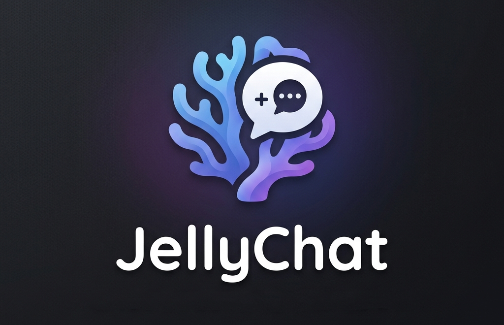

# JellyChat


**JellyChat** is a [Jellyfin](https://jellyfin.org/) plugin that adds a lightweight, local chat to your **SyncPlay** rooms.



---

## Installation

Install JellyChat from plugin repository:

1. In Jellyfin, open **Menu → Settings → Dashboard → Plugins → Repositories**.
2. Click **➕** to add a new repository, give it a name (e.g. `JellyChat`), and paste the repository URL:

   ```
   https://raw.githubusercontent.com/Akaki411/JellyChat-plugin/9985fa6e2209edd75f32bbbb21ccfd8c5e7586d5/manifest.json
   ```

3. Go to **Dashboard → Restart Jellyfin** and let the server come back up.
4. Open **Dashboard → Plugins → Catalog**, find **JellyChat**, and click **Install**.
5. Restart Jellyfin again so that the plugin can embed its client, then completely update the web client (`Ctrl+Shift+R`) if necessary.

> Start (or join) a SyncPlay group and the chat button will appear in the player.

---

## Development setup

The project has two parts: a **React frontend** (`web-src/`) that is bundled into a single `interface.js` and embedded into the plugin, and the **.NET plugin** (`Jellyfin.Plugin.JellyChat/`) that serves and injects it.

### Prerequisites

- [**mise**](https://mise.jdx.dev/) — manages the .NET SDK pinned in [`mise.toml`](mise.toml) (`dotnet = "9.0"`).
- [**Node.js 18+**](https://nodejs.org/en) and **npm** — required to build the React frontend (Vite 5).

### Build with the scripts

Scripts build the frontend and the plugin in one step:

- **Linux / macOS:**
  ```bash
  ./scripts/build-linux.sh
  ```

- **Windows:**
  ```bat
  scripts\build-windows.bat
  ```

### Build manually

```bash
# 1. Build the React frontend → Jellyfin.Plugin.JellyChat/web/interface.js
cd web-src
npm install
npm run build
cd ..

# 2. Build/publish the .NET plugin (embeds interface.js)
mise exec dotnet@9.0 -- dotnet publish Jellyfin.Plugin.JellyChat/Jellyfin.Plugin.JellyChat.csproj -c Release
```

#### After the build, the plugin will be available in:

```
Jellyfin.Plugin.JellyChat/bin/Release/net9.0/publish/
```

### Deploying a local build

Copy `Jellyfin.Plugin.JellyChat.dll` into a `JellyChat` subfolder of your Jellyfin **plugins** directory, then restart Jellyfin. The plugins directory depends on the OS:

| Platform | Plugins directory |
| --- | --- |
| Windows | `%ProgramData%\Jellyfin\Server\plugins\JellyChat\` |
| Linux (package) | `/var/lib/jellyfin/plugins/JellyChat/` |
| Docker | `/config/plugins/JellyChat/` |
| macOS | `~/.local/share/jellyfin/plugins/JellyChat/` |

> The DLL is locked while Jellyfin is running, so stop the server before overwriting it. On Windows, Jellyfin is typically launched by the tray app (`Jellyfin.Windows.Tray.exe`) rather than as a service — stop both `jellyfin` and the tray, copy the DLL, then relaunch.

Plugin GUID: `d3e50ec8-d597-488a-828f-db31d69c095a`

---

## Gratitude

JellyChat is a fork of [**jellyfin-syncplay-chat**](https://github.com/AbhayVAshokan/jellyfin-syncplay-chat) by [**AbhayVAshokan**](https://github.com/AbhayVAshokan). The project uses the core of this chat realisation.

---

## License

This project is licensed under the **GNU General Public License v3.0**. See the [LICENSE](LICENSE)
